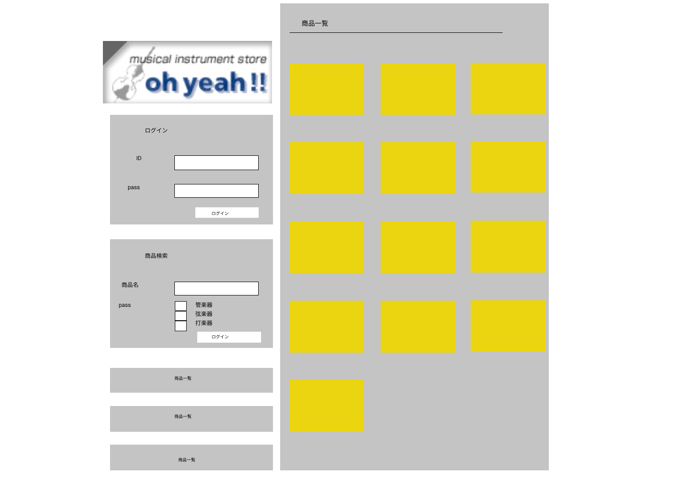

### 画面詳細図
## トップページ
### プロトタイプは以下のリンク先
[プロトタイプ](https://www.figma.com/file/0iiJP7KwRtu2cOvpAPoogL/Untitled?node-id=1%3A2)
*****

*****
補足：対応DBの列はDB設計後、〇を対応するテーブル・カラムに差し替えること
| ID | 要素 | 内容 | アクション | イベント | 対応DB |
|----|-----|------|----------|----------|--------|
|1|バナー|サイト名表示|ー　　　|ー　　　　　|　　ー　|
|2|ログイン|テキスト画像|-    |-          |-      |
